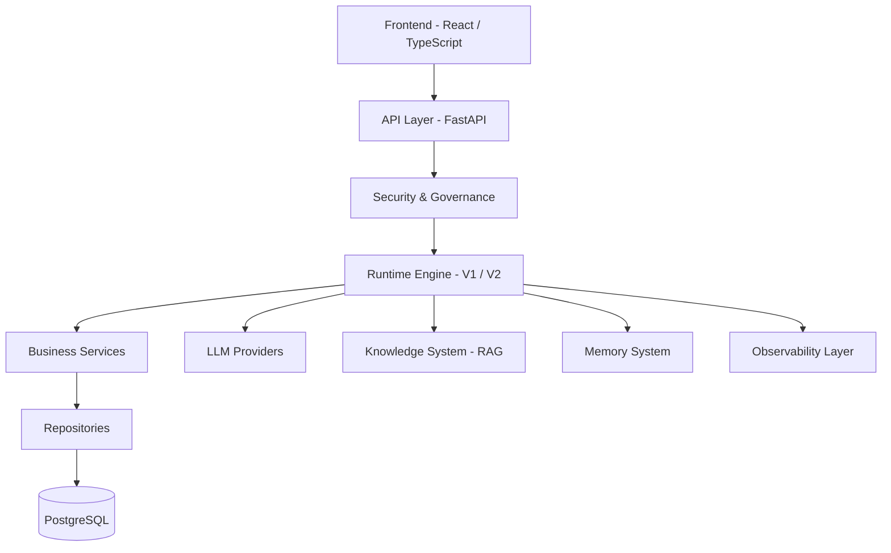
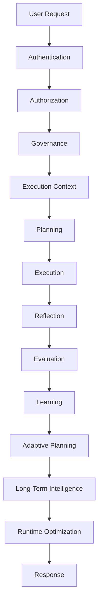
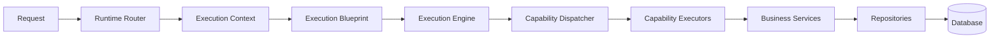
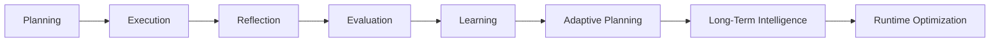
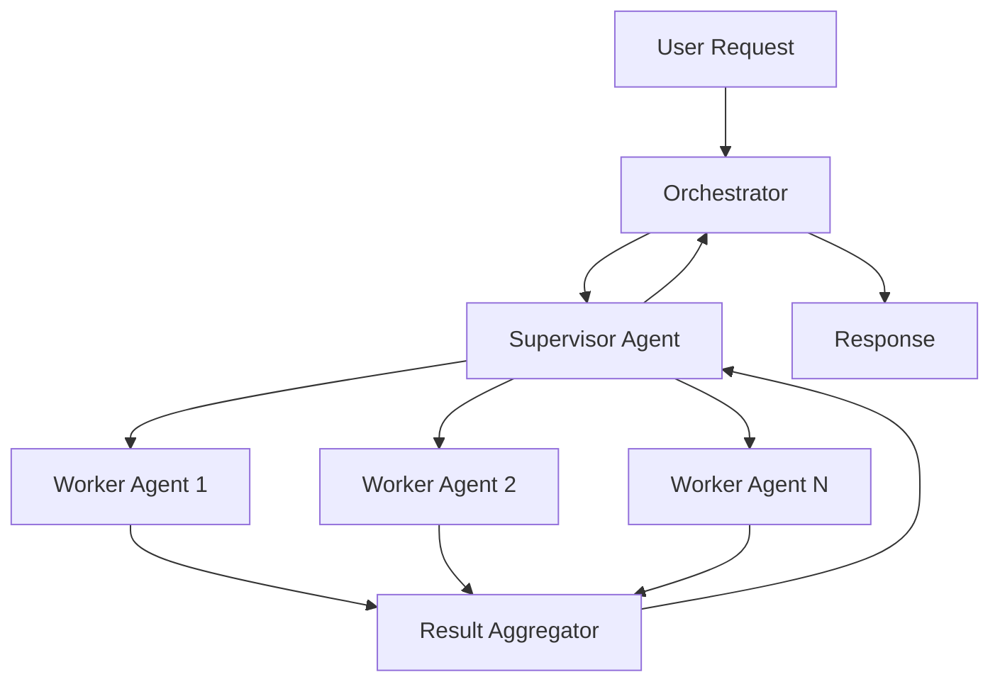
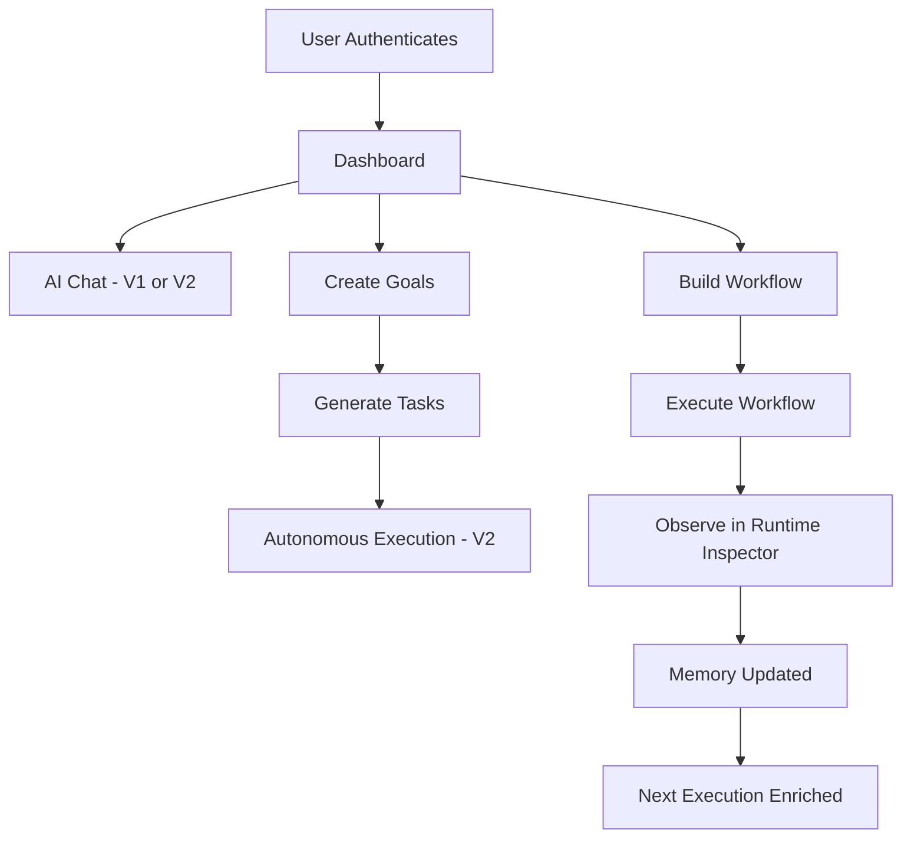

# AgentCorp

**Enterprise AI Operating System**

AgentCorp is a full-stack Enterprise AI Operating System that combines a modular runtime, Agentic AI, multi-agent orchestration, retrieval-augmented generation, memory, workflow automation, governance, and observability to enable secure, intelligent, and scalable enterprise AI applications.

---

## Table of Contents

- [Overview](#overview)
- [Vision](#vision)
- [Objectives](#objectives)
- [Key Features](#key-features)
- [Runtime Versions](#runtime-versions)
- [High-Level Architecture](#high-level-architecture)
- [Runtime Execution Pipeline](#runtime-execution-pipeline)
- [Core Components](#core-components)
- [AI Capabilities](#ai-capabilities)
- [Cognitive Pipeline](#cognitive-pipeline)
- [Multi-Agent Architecture](#multi-agent-architecture)
- [Goal Management](#goal-management)
- [Task Management](#task-management)
- [Workflow Engine](#workflow-engine)
- [Knowledge System](#knowledge-system)
- [Memory System](#memory-system)
- [Runtime Governance](#runtime-governance)
- [Runtime Observability](#runtime-observability)
- [Frontend Overview](#frontend-overview)
- [Backend Overview](#backend-overview)
- [Security Features](#security-features)
- [Technology Stack](#technology-stack)
- [Repository Structure](#repository-structure)
- [Installation](#installation)
- [Environment Configuration](#environment-configuration)
- [Running the Backend](#running-the-backend)
- [Running the Frontend](#running-the-frontend)
- [Available Runtime Modes](#available-runtime-modes)
- [Project Workflow](#project-workflow)
- [API Overview](#api-overview)
- [Design Principles](#design-principles)
- [Current Project Status](#current-project-status)
- [Future Roadmap](#future-roadmap)
- [Contributing](#contributing)
- [License](#license)
- [Author](#author)

---

## Overview

AgentCorp is a full-stack enterprise platform that treats AI not as a standalone assistant but as a managed subsystem inside a larger operating system. Every user request is routed through a deterministic execution runtime that handles planning, governance, execution, reflection, and learning before a response is produced.

The platform is composed of two runtimes. Runtime V1 provides standard LLM-backed interactions. Runtime V2 introduces the full enterprise architecture including cognitive planning, autonomous execution, multi-agent orchestration, memory consolidation, and runtime optimization.

AgentCorp is designed to support organizations that require predictable, auditable, and extensible AI capabilities integrated into business workflows.

---

## Vision

The goal of AgentCorp is to provide a unified platform where AI capabilities can be integrated into enterprise workflows without sacrificing reliability, transparency, governance, or maintainability.

Rather than treating AI as a standalone service, AgentCorp treats AI as one component of a larger operating system responsible for orchestrating business processes, managing state, enforcing policy, and evolving over time through accumulated intelligence.

---

## Objectives

- Build an enterprise-ready AI operating platform.
- Provide a deterministic runtime for AI execution.
- Support intelligent workflow orchestration.
- Enable secure AI execution through governance and policy enforcement.
- Improve AI responses using memory and knowledge retrieval.
- Offer complete runtime observability and diagnostics.
- Maintain a modular, extensible, and scalable architecture.

---

## Key Features

| Feature | Description |
|---|---|
| Dual Runtime | Runtime V1 for standard interactions; Runtime V2 for enterprise agentic execution |
| Cognitive Pipeline | Planning, execution, reflection, evaluation, learning, and adaptive planning |
| Multi-Agent Orchestration | Supervisor and worker agent coordination with shared context |
| Retrieval-Augmented Generation | Knowledge-grounded responses using semantic retrieval |
| Memory System | Short-term, long-term, conversation, and project memory |
| Workflow Engine | Graph-based execution pipelines with typed nodes |
| Enterprise Governance | Policy, approval, and compliance validation before execution |
| Runtime Observability | Execution graphs, timelines, diagnostics, and trace history |
| Role-Based Access Control | Organization-scoped permissions and JWT-based authentication |
| Modular Backend | Layered FastAPI backend with isolated services, repositories, and providers |
| Enterprise Frontend | Full workspace UI with fourteen major sections and V1/V2 switching |

---

## Runtime Versions

### Runtime V1

Runtime V1 provides a traditional AI-assisted experience backed by a configurable LLM provider.

Characteristics:

- Standard request and response processing.
- Provider-based LLM interaction (Groq, OpenAI, Anthropic, Gemini, Ollama, OpenRouter).
- No autonomous execution.
- No multi-agent orchestration.
- No cognitive pipeline.
- Suitable for conventional AI applications and integration testing.

### Runtime V2

Runtime V2 introduces the full enterprise runtime architecture.

Features:

- Cognitive planning and intent decomposition.
- Goal and task management as first-class entities.
- Autonomous execution lifecycle.
- Multi-agent orchestration with supervisor and worker roles.
- Reflection and evaluation of execution outcomes.
- Learning and adaptive planning based on results.
- Long-term intelligence through memory consolidation and pattern discovery.
- Runtime optimization recommendations.
- Enterprise governance with policy, approval, and compliance layers.
- Full runtime observability.

---

## High-Level Architecture



---

## Runtime Execution Pipeline

Every request processed by Runtime V2 follows a structured pipeline.



This pipeline ensures that requests are processed consistently and that each execution contributes to the platform's accumulated intelligence.

---

## Core Components



| Component | Responsibility |
|---|---|
| Runtime Router | Routes requests to the appropriate runtime version |
| Execution Context | Aggregates user, organization, session, and configuration data |
| Execution Blueprint | Structured plan produced by the cognitive planning stage |
| Execution Engine | Orchestrates the execution of capabilities |
| Capability Dispatcher | Selects and dispatches individual capabilities |
| Capability Executors | Execute discrete units of work |
| Business Services | Domain-level logic (chat, goals, tasks, workflows, knowledge, memory) |
| Repositories | Data access abstraction layer |

---

## AI Capabilities

AgentCorp supports the following AI capabilities:

- Natural language understanding and generation via configurable LLM providers.
- Retrieval-augmented generation using semantic search over enterprise knowledge bases.
- Tool invocation during agentic execution.
- Multi-agent delegation and result aggregation.
- Streaming response output for real-time interaction.
- Context-aware memory retrieval to enrich execution with historical information.

---

## Cognitive Pipeline

The cognitive pipeline is the intelligence layer of Runtime V2.



| Stage | Description |
|---|---|
| Planning | Transforms user intent into a structured execution blueprint |
| Execution | Runs required capabilities to complete the request |
| Reflection | Analyzes execution outcomes and identifies improvement opportunities |
| Evaluation | Measures response quality and execution performance |
| Learning | Extracts reusable insights from completed executions |
| Adaptive Planning | Refines future execution plans based on past results |
| Long-Term Intelligence | Maintains persistent intelligence through memory consolidation, pattern discovery, preference evolution, and capability scoring |
| Runtime Optimization | Produces optimization recommendations for providers, tools, workflows, and capabilities |

---

## Multi-Agent Architecture

Runtime V2 supports coordinated multi-agent execution.



Components:

- **Orchestrator** — Manages overall multi-agent execution flow.
- **Supervisor Agent** — Coordinates worker agents, handles delegation and aggregation.
- **Worker Agents** — Execute discrete tasks within the shared execution context.
- **Message Bus** — Facilitates inter-agent communication.
- **Shared Execution Context** — Maintains consistent state across all agents in a session.

---

## Goal Management

Goals are first-class entities within AgentCorp. The platform treats goals as persistent, trackable objectives that drive downstream task generation and autonomous execution.

Each goal can include:

- Title and description.
- Priority level.
- Status tracking (draft, active, paused, completed, cancelled).
- Milestones.
- Association with projects.
- Association with workflows.
- Related tasks.

Goals drive the autonomous execution lifecycle and can be decomposed into individual tasks by the runtime.

---

## Task Management

Tasks are derived from goals or created independently and managed through a dedicated service.

Capabilities include:

- Task dependency declaration.
- Priority assignment.
- Status tracking.
- Queue management.
- Timeline support.
- Assignment to agents or users.

The autonomous execution engine selects ready tasks from the queue and executes them through the standard runtime pipeline.

---

## Workflow Engine

Workflows are graph-based execution pipelines that define multi-step business processes.

Supported node types:

| Node Type | Description |
|---|---|
| Start | Entry point of the workflow |
| Goal | Associates the workflow with a goal |
| Task | Executes a discrete task |
| Agent | Delegates to an AI agent |
| Tool | Invokes a registered tool |
| Knowledge | Retrieves from the knowledge system |
| Memory | Reads from or writes to the memory system |
| Decision | Conditional branching |
| Approval | Pauses execution pending human approval |
| Reflection | Triggers the cognitive reflection stage |
| Evaluation | Measures workflow quality |
| Learning | Captures workflow insights |
| Runtime | Executes through the runtime engine |
| End | Terminal node |

Workflows support directed acyclic graphs with typed edges and conditional branching.

---

## Knowledge System

AgentCorp includes a Retrieval-Augmented Generation knowledge layer that enriches runtime responses with enterprise-specific information.

Capabilities:

- Knowledge collections and document management.
- Category-based organisation.
- Semantic retrieval using vector embeddings.
- Project-scoped knowledge association.
- Chunk-level document processing.
- Knowledge relationships and cross-references.

The knowledge system is queried automatically during Runtime V2 execution before response generation.

> Note: The vector database provider is configurable. The current implementation targets pgvector. Full RAG pipeline activation requires a compatible embedding provider.

---

## Memory System

The memory system maintains persistent context across sessions and executions.

Memory categories:

| Category | Description |
|---|---|
| Short-Term Memory | In-session working context |
| Long-Term Memory | Persistent knowledge accumulated across sessions |
| Conversation Memory | Per-conversation history and preferences |
| Project Memory | Project-scoped context and accumulated insights |

Memory evolves through the learning pipeline and is retrieved automatically to enrich future executions.

---

## Runtime Governance

Every Runtime V2 request passes through an enterprise governance layer before execution begins.

Governance stages:

| Stage | Description |
|---|---|
| Policy Validation | Validates the request against configured organizational policies |
| Approval Validation | Checks whether the request requires human approval |
| Compliance Validation | Ensures the request satisfies compliance requirements |
| Execution Guard | Final gatekeeper before the execution engine receives the request |

Governance is non-negotiable in Runtime V2 and cannot be bypassed by application code.

---

## Runtime Observability

AgentCorp provides a dedicated observability layer for monitoring execution without interfering with the runtime.

Observability capabilities:

- Runtime overview and system health.
- Architecture graph visualization.
- Execution graph for individual requests.
- Execution timeline.
- Diagnostics and error tracing.
- Runtime snapshots.
- Search across execution history.
- Full trace history per session.

The observability layer is read-only. It is designed for monitoring and diagnosis, not for triggering or modifying executions.

---

## Frontend Overview

The frontend is a React and TypeScript application built with Vite that provides a complete enterprise workspace.

Major workspace sections:

| Section | Description |
|---|---|
| Dashboard | Overview of system activity and status |
| Projects | Project management and organisation |
| Goals | Goal creation, tracking, and management |
| Tasks | Task management and queue |
| AI Chat | Interactive AI conversation interface |
| Agents | Agent configuration and monitoring |
| Workflow Builder | Visual workflow graph editor |
| Knowledge Base | Knowledge collection and document management |
| Memory Explorer | Browsing and inspection of the memory system |
| Tool Registry | Registration and management of tools |
| Runtime Inspector | Live runtime execution inspection |
| Observability | Execution graphs, timelines, and diagnostics |
| Settings | User, organization, and runtime configuration |
| Documentation Center | In-app documentation |

Frontend capabilities:

- Light and dark theme.
- Runtime V1 and V2 switching.
- Responsive layout.
- JWT-based authentication.
- TanStack Query for server state management.
- Error boundary and protected route handling.
- Streaming response support.

---

## Backend Overview

The backend is a Python FastAPI application with a layered, modular architecture.

| Layer | Responsibility |
|---|---|
| API | HTTP endpoints and request routing |
| Runtime | Core execution engine for V1 and V2 |
| Services | Domain business logic |
| Security | Authentication, authorization, governance, policy |
| Providers | LLM provider abstraction (Groq, OpenAI, Anthropic, Gemini, Ollama, OpenRouter) |
| Models | SQLAlchemy ORM models |
| Repositories | Database access abstraction |
| Schemas | Pydantic request and response models |
| Observability | Middleware and diagnostics |
| Database | PostgreSQL via SQLAlchemy async engine |

Database migrations are managed with Alembic.

---

## Security Features

Security is integrated at every layer of the platform.

| Feature | Description |
|---|---|
| JWT Authentication | Access and refresh token lifecycle management |
| Role-Based Access Control | Permission scoping by role and organization |
| Organization Isolation | Data and execution scoped to the authenticated organization |
| Runtime Governance | Policy, approval, and compliance validation |
| Approval Workflows | Human-in-the-loop approval gates |
| Policy Enforcement | Configurable execution policies per organization |
| Audit Logging | Immutable record of security-relevant events |
| PII Detection | Identification of personally identifiable information in requests |
| Secrets Management | Centralized configuration of provider credentials |
| Input Sanitization | Validation and sanitization of all incoming request data |

---

## Technology Stack

### Frontend

| Technology | Purpose |
|---|---|
| React 19 | UI component framework |
| TypeScript | Static typing |
| Vite | Build tooling and development server |
| TanStack Query | Server state management |
| CSS | Styling |

### Backend

| Technology | Purpose |
|---|---|
| Python 3.12 | Primary backend language |
| FastAPI | HTTP API framework |
| SQLAlchemy | ORM and database abstraction |
| Alembic | Database schema migrations |
| Pydantic | Data validation and serialisation |
| PostgreSQL | Primary relational database |

### AI and Runtime

| Technology | Purpose |
|---|---|
| Groq | Primary LLM provider (configurable) |
| RAG | Retrieval-augmented generation |
| Agentic AI | Autonomous task execution |
| Multi-Agent Systems | Coordinated agent orchestration |
| Workflow Orchestration | Graph-based execution pipelines |

### Testing

| Technology | Purpose |
|---|---|
| Pytest | Python unit and integration testing |
| Playwright | End-to-end browser testing |

---

## Repository Structure

```
AgentCorp/
├── apps/
│   ├── backend/                  # FastAPI backend application
│   │   ├── alembic/              # Database migrations
│   │   ├── app/
│   │   │   ├── api/              # API routers and endpoints
│   │   │   ├── agent_engine/     # Agentic execution engine
│   │   │   ├── config/           # Application configuration and settings
│   │   │   ├── core/             # Lifespan, database, and startup
│   │   │   ├── dependencies/     # FastAPI dependency injection
│   │   │   ├── exceptions/       # Exception handlers
│   │   │   ├── knowledge/        # Knowledge processing and chunking
│   │   │   ├── memory/           # Memory system
│   │   │   ├── middleware/        # CORS, security, observability middleware
│   │   │   ├── models/           # SQLAlchemy ORM models
│   │   │   ├── multi_agent/      # Multi-agent orchestration
│   │   │   ├── observability/    # Diagnostics and runtime observability
│   │   │   ├── providers/        # LLM provider implementations
│   │   │   ├── rag/              # Retrieval-augmented generation
│   │   │   ├── repositories/     # Database access layer
│   │   │   ├── runtime/          # Runtime V1 and V2 execution engine
│   │   │   ├── schemas/          # Pydantic schemas
│   │   │   ├── security/         # Security, governance, policy
│   │   │   ├── services/         # Business logic services
│   │   │   ├── tools/            # Tool registry and execution
│   │   │   ├── utils/            # Shared utilities
│   │   │   └── workflow/         # Workflow engine
│   │   ├── tests/                # Backend test suite
│   │   ├── .env.example          # Environment variable template
│   │   └── requirements.txt      # Python dependencies (to be populated)
│   └── frontend/                 # React TypeScript frontend
│       ├── src/
│       │   ├── integration/      # API clients, hooks, contexts, types
│       │   └── ui/               # Application UI components
│       ├── .env.example          # Frontend environment variable template
│       ├── .env.development      # Development environment configuration
│       ├── .env.production       # Production environment configuration
│       ├── package.json
│       ├── tsconfig.json
│       └── vite.config.ts
├── docs/                         # Project documentation
├── tests/                        # Root-level integration and e2e tests
├── scripts/                      # Utility scripts
├── pyproject.toml                # Python build and test configuration
├── pytest.ini                    # Pytest configuration
├── .gitignore
└── README.md
```

---

## Installation

### Prerequisites

- Node.js 20 or later
- Python 3.12 or later
- PostgreSQL 15 or later
- Git

### Clone the Repository

```bash
git clone https://github.com/rachitkumar2105/AgentCorp.git
cd AgentCorp
```

### Frontend Dependencies

```bash
cd apps/frontend
npm install
```

### Backend Dependencies

```bash
cd apps/backend
python -m venv .venv
# On Windows
.venv\Scripts\activate
# On macOS / Linux
source .venv/bin/activate

pip install -r requirements.txt
```

> Note: `requirements.txt` is under active development. Dependencies include `fastapi`, `uvicorn`, `sqlalchemy`, `alembic`, `pydantic`, `psycopg`, `python-jose`, `passlib`, and `groq`. Install individually until the file is populated.

---

## Environment Configuration

### Backend

Copy the template and configure your environment:

```bash
cp apps/backend/.env.example apps/backend/.env
```

Key variables to configure:

| Variable | Description |
|---|---|
| `SECRET_KEY` | Application secret key (generate with `python -c "import secrets; print(secrets.token_urlsafe(64))"`) |
| `JWT_SECRET_KEY` | JWT signing key |
| `DATABASE_URL` | PostgreSQL connection string |
| `GROQ_API_KEY` | Groq API key (required for Runtime V1 and V2) |
| `DEFAULT_PROVIDER` | LLM provider to use (`groq`, `openai`, `anthropic`, `gemini`, `ollama`, `openrouter`) |
| `BACKEND_CORS_ORIGINS` | Comma-separated list of allowed frontend origins |

See `apps/backend/.env.example` for the complete list of configurable variables.

### Frontend

The frontend reads environment variables from `.env.development` (development) and `.env.production` (production).

| Variable | Description |
|---|---|
| `VITE_BACKEND_URL` | Backend API base URL (default: `http://localhost:8000`) |
| `VITE_API_VERSION` | API version prefix (default: `v1`) |
| `VITE_RUNTIME_VERSION` | Default runtime version (`V1` or `V2`) |

---

## Running the Backend

Ensure PostgreSQL is running and the `.env` file is configured.

Run database migrations:

```bash
cd apps/backend
alembic upgrade head
```

Start the development server:

```bash
uvicorn app.main:app --host 0.0.0.0 --port 8000 --reload
```

The API will be available at `http://localhost:8000`.

Interactive API documentation is available at `http://localhost:8000/docs`.

---

## Running the Frontend

```bash
cd apps/frontend
npm run dev
```

The frontend will be available at `http://localhost:5173`.

To build for production:

```bash
npm run build
```

---

## Available Runtime Modes

| Mode | Description |
|---|---|
| Runtime V1 | Standard LLM-backed interaction. No autonomous execution or multi-agent orchestration. |
| Runtime V2 | Full enterprise runtime. Includes cognitive pipeline, governance, multi-agent orchestration, memory, knowledge retrieval, and runtime optimization. |

The active runtime version can be switched from the frontend Settings workspace or configured via the `VITE_RUNTIME_VERSION` environment variable.

---

## Project Workflow



---

## API Overview

The backend exposes a versioned REST API under the `/api/v1` prefix.

High-level endpoint groups:

| Group | Base Path | Description |
|---|---|---|
| Authentication | `/api/v1/auth` | Login, logout, token refresh, registration |
| Users | `/api/v1/users` | User profile and management |
| Organizations | `/api/v1/organizations` | Organization management and membership |
| Projects | `/api/v1/projects` | Project CRUD |
| Goals | `/api/v1/goals` | Goal management |
| Tasks | `/api/v1/tasks` | Task management |
| Chat | `/api/v1/chat` | AI chat interaction (V1 and V2) |
| Agents | `/api/v1/agents` | Agent configuration |
| Workflows | `/api/v1/workflows` | Workflow management and execution |
| Knowledge | `/api/v1/knowledge` | Knowledge base management |
| Memory | `/api/v1/memory` | Memory retrieval and management |
| Tools | `/api/v1/tools` | Tool registry |
| Runtime | `/api/v1/runtime` | Runtime inspection and configuration |
| Observability | `/api/v1/observability` | Execution traces and diagnostics |
| Security | `/api/v1/security` | Security policy and audit management |

Full API documentation is available via the interactive Swagger UI at `/docs` when the backend is running.

---

## Design Principles

| Principle | Description |
|---|---|
| Modularity | Every component has a single, clearly defined responsibility and can evolve independently. |
| Deterministic Runtime | Rule-based orchestration ensures predictable, auditable execution behaviour where appropriate. |
| Separation of Concerns | Presentation, execution, business logic, and persistence are strictly isolated from one another. |
| Extensibility | New capabilities, providers, tools, and workflow nodes can be added without modifying the runtime core. |
| Observability | Every stage of execution produces traceable, queryable data. |
| Enterprise Readiness | Governance, security, audit logging, and diagnostics are integral to the architecture, not optional additions. |

---

## Current Project Status

AgentCorp is under active development. The following components are implemented:

| Component | Status |
|---|---|
| Runtime V1 | Implemented |
| Runtime V2 (core) | Implemented |
| Enterprise Frontend (14 workspaces) | Implemented |
| AI Execution Pipeline | Implemented |
| Multi-Agent Orchestration | Implemented |
| Knowledge System | Implemented |
| Memory System | Implemented |
| Governance Layer | Implemented |
| Runtime Observability | Implemented |
| Backend Integration Layer | Implemented |
| JWT Authentication | Implemented |
| RBAC and Organization Isolation | Implemented |
| Workflow Engine | Implemented |
| Tool Registry | Implemented |
| LLM Provider Abstraction | Implemented |
| RAG Pipeline | Partially implemented (requires embedding provider configuration) |
| Database Migrations | Implemented via Alembic |
| Backend `requirements.txt` | Under development |
| Cloud deployment | Not implemented |
| CI/CD pipeline | Not implemented |
| Container configuration | Not implemented |

---

## Future Roadmap

Planned areas of continued development:

- Populated `requirements.txt` and backend packaging.
- Expanded cloud deployment documentation and configuration.
- Enhanced enterprise integrations with external systems.
- Additional LLM provider support.
- Advanced analytics and reporting within the observability layer.
- Broader workflow automation capabilities and node types.
- Extended test coverage, including integration and end-to-end tests.
- Performance benchmarking and optimization.
- Container and infrastructure configuration for self-hosted deployment.

---

## Contributing

Contributions are welcome. Please follow the standard fork-and-pull-request workflow.

1. Fork the repository.
2. Create a feature branch from `main`.
3. Make your changes with appropriate test coverage.
4. Open a pull request with a clear description of the change.

Please ensure that no secrets, credentials, build artifacts, or `__pycache__` directories are included in commits. Review `.gitignore` before staging files.

For significant changes, open an issue first to discuss the proposed approach.

---

## License

This project is licensed under the terms of the [LICENSE](LICENSE) file included in the repository.

---

## Author

**Rachit Kumar Singh**

Email: rachitkumar2105@gmail.com

GitHub: [https://github.com/rachitkumar2105](https://github.com/rachitkumar2105)

Project: [AgentCorp](https://github.com/rachitkumar2105/AgentCorp)
